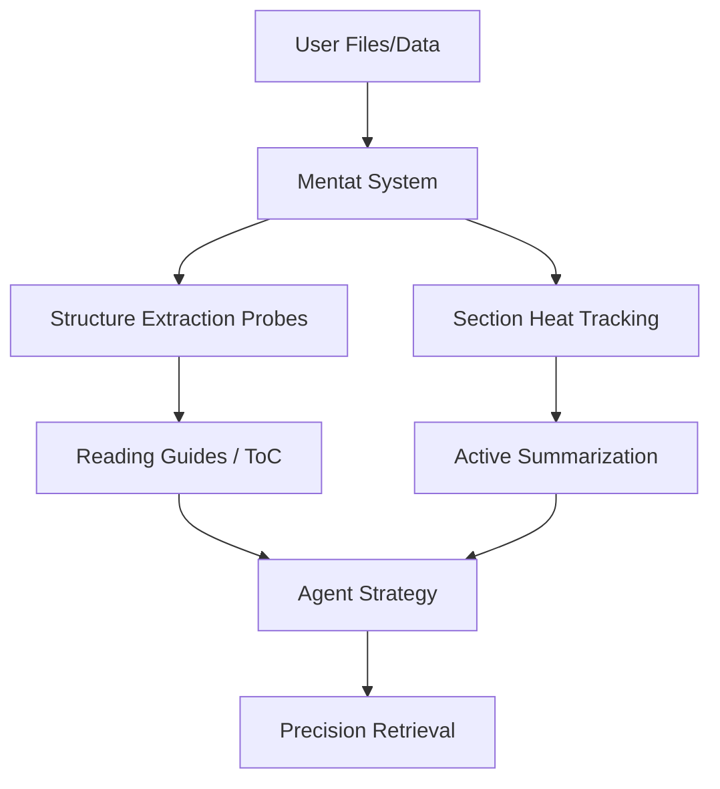

# Mentat

> **Strategic Retrieval. Not just RAG.**
>
> _The bridge between noisy RAG and expensive GraphRAG. A system designed to connect your data, agents, and scaling context._

---

## What is Mentat?

Mentat isn't just another vector search tool; it's a **Strategic Retrieval System**.

Traditional RAG often suffers from "Token Explosion" — feeding massive documents into an LLM just to find one detail. GraphRAG attempts to solve logic with knowledge graphs but is often too slow and prohibitively expensive for production.

**Mentat strikes the balance.** It extracts the logical structure of your files (ToC, hierarchy, metadata) without LLM overhead and provides a **Two-Step Protocol** that allows agents to find, then read, exactly what they need.

### The Efficiency Story

Imagine reading a 10,000 token PDF.
- **Traditional RAG**: Feed the whole thing to the agent &rarr; **10,000 tokens**.
- **Mentat**:
  1. Agent reads the Table of Contents (ToC) &rarr; **500 tokens**.
  2. Agent identifies the relevant chapter and requests only that segment &rarr; **1,000 tokens**.
  3. **Total: 1,500 tokens** (85% savings).

### Pluggable Architecture

Mentat is designed as a **framework**, not a monolith. Every major subsystem is behind an abstract interface, so you can swap implementations without changing application code:

| Subsystem | Interface | Built-in | You can plug in... |
|-----------|-----------|----------|-------------------|
| Vector storage | `BaseVectorStorage` | LanceDB | Qdrant, Pinecone, Weaviate, pgvector, ... |
| Embedding models | `EmbeddingRegistry` (via litellm) | OpenAI, Gemini, Ollama, ... | Any litellm-compatible provider |
| Summarization LLM | Librarian (via litellm) | GPT-4o-mini, Claude, ... | Any litellm-compatible model |
| Format probes | `BaseProbe` | 13 built-in probes | Custom probes for any format |
| Lifecycle hooks | `BaseAdaptor` | &mdash; | Knowledge graph builders, external sync, custom routing |
| Search filters | `MetadataFilterSet` | LanceDB SQL | Translatable to any backend query language |

**Key extension points:**

```python
import mentat

# 1. Register a custom vector storage backend
from mentat import BaseVectorStorage

class QdrantStorage(BaseVectorStorage):
    """Implement add_stub, search, get_chunks_by_doc, etc."""
    ...

# 2. Register lifecycle hooks (e.g. build a knowledge graph on indexing)
from mentat import BaseAdaptor

class KnowledgeGraphAdaptor(BaseAdaptor):
    def on_document_indexed(self, doc_id, metadata):
        # Extract entities and relationships, update your graph DB
        ...
    def on_search_results(self, query, results):
        # Enrich results with graph-based context
        return results
    def transform_query(self, query):
        # Rewrite queries using graph knowledge
        return query

mentat.register_adaptor(KnowledgeGraphAdaptor())

# 3. Register a custom probe for a proprietary format
from mentat.probes.base import BaseProbe, ProbeResult

class CustomFormatProbe(BaseProbe):
    def can_handle(self, filename, content_type):
        return filename.endswith(".custom")
    def run(self, filepath, filename):
        # Extract structure, chunks, and metadata
        return ProbeResult(filename=filename, file_type="custom", ...)

# 4. Use metadata filters for fine-grained search
from mentat import MetadataFilter, MetadataFilterSet

filters = MetadataFilterSet(filters=[
    MetadataFilter(field="source", op="like", value="composio:%"),
    MetadataFilter(field="file_type", op="in", value=["pdf", "docx"]),
])
```



---

## Core Innovations

### 1. The Two-Step Retrieval Protocol

Mentat formalizes the "Discovery &rarr; Extraction" workflow:
- **Discovery (`search(toc_only=True)`)**: Search across your collection and receive logical "Reading Guides" — compact summaries and tables of contents — instead of raw data.
- **Extraction (`read_segment(doc_id, section)`)**: Agents use the guide to pinpoint the exact section they need, saving massive context window space.

### 2. Practical GraphRAG Paradigm

Mentat achieves the logical depth of GraphRAG through structure-aware "fingerprinting":
- **Structure via Probes**: 13+ specialized probes (PDF, Code, JSON, etc.) extract hierarchy and anchors using fast, non-LLM statistical methods.
- **Access-Pattern Intelligence**: The system tracks which sections are "hot" vs. "cold". Frequent access triggers high-quality LLM summarization, while cold content is gracefully "forgotten" (evicted from the active cache) to maintain performance.

### 3. Smart Bypass & Merging
- **Small-File Passthrough**: Files under 1000 tokens bypass summarization — it's cheaper to read the whole thing.
- **Hierarchical Chunking**: Unlike blind "sliding windows," Mentat respects H1/H2 boundaries, ensuring chunks never cross major logical breaks.

---

## Features at a Glance

- **13+ Format Probes**: PDF, Code (Python, JS, TS), Word, PPTX, CSV, JSON, Markdown, Logs, Archives, and more.
- **Heat Tracking**: Weighted scoring (read_segment > inspect > search) with exponential time decay.
- **Multi-Provider LLM**: Powered by `litellm` — use OpenAI, Claude, Gemini, Ollama, or any custom endpoint.
- **Hybrid Search**: LanceDB-powered vector + full-text search with reranking.
- **File Watcher**: Auto-reindex on changes with content-hash deduplication.
- **Async Indexing**: Return immediately (~1-3s) while embeddings process in the background.
- **Pluggable Storage**: Swap LanceDB for any vector database via `BaseVectorStorage`.
- **Lifecycle Hooks**: `BaseAdaptor` for knowledge graph integration, custom routing, and result enrichment.

---

## Installation

```bash
pip install mentat-sr
```

Optional extras for additional format support:

```bash
pip install mentat-sr[image]      # Pillow for image metadata extraction
pip install mentat-sr[office]     # python-docx + python-pptx
pip install mentat-sr[calendar]   # icalendar
pip install mentat-sr[web]        # trafilatura for HTML content extraction
pip install mentat-sr[all]        # Everything
```

---

## Quick Start

### Python API

```python
import mentat
import asyncio

async def main():
    # 1. Index a document (returns immediately, processes in background)
    doc_id = await mentat.add("large_report.pdf")

    # 2. Discovery: search with ToC mode (step 1)
    results = await mentat.search("revenue", toc_only=True)
    for r in results:
        print(f"File: {r.filename}")
        print(f"Guide: {r.instructions}")
        print(f"ToC: {[t.title for t in r.toc_entries]}")

    # 3. Extraction: read the specific section (step 2)
    segment = await mentat.read_segment(doc_id, "Q3 Financial Highlights")
    for chunk in segment["chunks"]:
        print(chunk["content"])

asyncio.run(main())
```

### CLI

```bash
# Probe a file's structure instantly (no LLM, no storage)
mentat probe research.pdf

# Index files or directories
mentat index ./docs --summarize

# Two-step search
mentat search "market trends" --toc-only
mentat segment <doc_id> "Market Analysis"

# List indexed documents
mentat list

# Check processing status
mentat status <doc_id>

# Start HTTP server
mentat serve --port 7832
```

---

## Configuration

Copy `.env.example` to `.env` and fill in your API keys:

```bash
# Summary model (fast/cheap — used for bulk chunk summarization)
# Accepts any litellm model string: openai/gpt-4o-mini, gemini/gemini-2.0-flash, ollama/llama3
MENTAT_SUMMARY_MODEL=openai/gpt-4o-mini
# MENTAT_SUMMARY_API_KEY=          # Overrides provider's global key
# MENTAT_SUMMARY_API_BASE=         # Custom endpoint (Azure, vLLM, local proxy)

# Embedding model (any litellm embedding model)
MENTAT_EMBEDDING_MODEL=openai/text-embedding-3-small
# MENTAT_EMBEDDING_API_KEY=
# MENTAT_EMBEDDING_API_BASE=

# Global provider API keys (litellm reads these natively)
OPENAI_API_KEY=sk-...
# ANTHROPIC_API_KEY=sk-ant-...
# GEMINI_API_KEY=...
# OLLAMA_API_BASE=http://localhost:11434

# Storage paths
MENTAT_DB_PATH=./mentat_db
MENTAT_STORAGE_DIR=./mentat_files

# Background processing
MENTAT_MAX_CONCURRENT_TASKS=5

# Section heat tracking
# MENTAT_SECTION_HEAT_HALF_LIFE=86400    # Decay half-life in seconds (default: 24h)
# MENTAT_SECTION_HEAT_THRESHOLD=5.0      # Score threshold for "hot"
# MENTAT_SECTION_HEAT_MAX_ENTRIES=1000    # Max tracked sections
```

Or configure programmatically:

```python
import mentat
from mentat import MentatConfig

mentat.configure(MentatConfig(
    summary_model="gemini/gemini-2.0-flash",
    embedding_model="openai/text-embedding-3-small",
    db_path="./my_db",
    storage_dir="./my_files",
    max_concurrent_tasks=10,
))
```

### MentatConfig Reference

| Field | Env Var | Default | Description |
|-------|---------|---------|-------------|
| `db_path` | `MENTAT_DB_PATH` | `./mentat_db` | Vector DB and metadata storage path |
| `storage_dir` | `MENTAT_STORAGE_DIR` | `./mentat_files` | Raw file copies storage path |
| `summary_model` | `MENTAT_SUMMARY_MODEL` | `gpt-4o-mini` | litellm model string for chunk summarization |
| `summary_api_key` | `MENTAT_SUMMARY_API_KEY` | `""` | API key override for summary model |
| `summary_api_base` | `MENTAT_SUMMARY_API_BASE` | `""` | Custom endpoint for summary model |
| `embedding_provider` | `MENTAT_EMBEDDING_PROVIDER` | `litellm` | Embedding provider |
| `embedding_model` | `MENTAT_EMBEDDING_MODEL` | `text-embedding-3-small` | Embedding model name |
| `embedding_api_key` | `MENTAT_EMBEDDING_API_KEY` | `""` | API key override for embedding |
| `embedding_api_base` | `MENTAT_EMBEDDING_API_BASE` | `""` | Custom endpoint for embedding |
| `max_concurrent_tasks` | `MENTAT_MAX_CONCURRENT_TASKS` | `5` | Background processing concurrency |
| `access_recent_size` | `MENTAT_ACCESS_RECENT_SIZE` | `200` | Recent-access LRU capacity |
| `access_hot_size` | `MENTAT_ACCESS_HOT_SIZE` | `50` | Hot-queue capacity |
| `chunk_target_tokens` | `MENTAT_CHUNK_TARGET_TOKENS` | `1000` | Target tokens per chunk |
| `section_heat_half_life` | `MENTAT_SECTION_HEAT_HALF_LIFE` | `86400.0` | Heat decay half-life (seconds) |
| `section_heat_threshold` | `MENTAT_SECTION_HEAT_THRESHOLD` | `5.0` | Score threshold for "hot" |
| `section_heat_max_entries` | `MENTAT_SECTION_HEAT_MAX_ENTRIES` | `1000` | Max tracked sections |

---

## Python API Reference

### Indexing

| Function | Description |
|----------|-------------|
| `await add(path, *, force, summarize, wait, source, metadata, collection)` | Index a file. Returns `doc_id`. |
| `await add_batch(paths, *, force, summarize, source, metadata)` | Batch index with single embedding call. Returns `List[doc_id]`. |
| `await add_content(content, filename, *, content_type, force, summarize, wait, source, metadata, collection)` | Index raw text. Returns `doc_id`. |

### Search & Retrieval

| Function | Description |
|----------|-------------|
| `await search(query, *, top_k, hybrid, toc_only, source, with_metadata, collections)` | Search chunks. Returns `List[MentatResult]`. |
| `await search_grouped(query, *, ...)` | Same as `search`, grouped by document. Returns `List[MentatDocResult]`. |
| `await inspect(doc_id, *, sections, full)` | Get document metadata + optional section summaries. |
| `await get_doc_meta(doc_id)` | Lightweight metadata (brief_intro, instructions, ToC). |
| `await read_segment(doc_id, section_path, *, include_summary)` | Read specific section content (step 2). |
| `await read_structured(path, *, sections, include_content)` | Structured file view (ToC + summaries). |

### Probe

| Function | Description |
|----------|-------------|
| `probe(path)` | Run probes without LLM/storage. Returns `ProbeResult`. |

### Lifecycle

| Function | Description |
|----------|-------------|
| `await start_processor()` | Start background worker. Call once on startup. |
| `await shutdown()` | Graceful shutdown. Call on exit. |
| `configure(config)` | Apply `MentatConfig` before first use. |

### Status & Stats

| Function | Description |
|----------|-------------|
| `get_status(doc_id)` | Processing status: `pending` / `processing` / `completed` / `failed`. |
| `await wait_for(doc_id, timeout=300)` | Block until processing completes. |
| `stats()` | System statistics (docs, chunks, storage size, etc.). |

### Access Tracking

| Function | Description |
|----------|-------------|
| `await track_access(path)` | Record access event. Hot files get auto-summarized. |
| `get_section_heat(doc_id=None, limit=20)` | Hottest sections by decayed score. |

### Collections

| Function | Description |
|----------|-------------|
| `collection(name)` | Get `Collection` handle for scoped add/search. |
| `collections()` | List all collection names. |
| `create_collection(name, *, metadata, watch_paths, watch_ignore, auto_add_sources)` | Create/update collection. |
| `get_collection_info(name)` | Get full collection record. |
| `delete_collection(name)` | Delete collection (not underlying docs). |
| `gc_collections()` | Remove expired collections (TTL-based). |

### Document Management

| Function | Description |
|----------|-------------|
| `list_docs(source=None)` | List all indexed documents, optionally filtered. |
| `delete(doc_id)` | Delete a document and all its chunks. |

### Skill Integration

| Function | Description |
|----------|-------------|
| `get_tool_schemas()` | OpenAI function calling tool schemas for agent integration. |
| `get_system_prompt()` | System prompt fragment teaching the two-step protocol. |
| `export_skill()` | Combined `{tools, system_prompt, version, protocol}`. |

### Extensibility

| Function | Description |
|----------|-------------|
| `register_adaptor(adaptor)` | Register a `BaseAdaptor` for lifecycle hooks. |

---

## CLI Reference

```
mentat [--debug] <command> [options]
```

| Command | Description |
|---------|-------------|
| `mentat index <paths> [--force] [--summarize] [--wait] [-c COLLECTION] [-j N]` | Index files or directories |
| `mentat list [--source SRC] [--format table\|json]` | List indexed documents |
| `mentat search <query> [-k N] [--hybrid] [--toc-only] [-c COLLECTION]` | Search for relevant content |
| `mentat inspect <doc_id> [--full]` | Show document metadata and ToC |
| `mentat segment <doc_id> <section>` | Read a specific section (step 2) |
| `mentat status <doc_id>` | Check processing status |
| `mentat probe <files> [--format rich\|json]` | Run probes (no LLM, no storage) |
| `mentat stats` | Show system statistics |
| `mentat collection list` | List collections |
| `mentat collection show <name>` | Show collection contents |
| `mentat collection delete <name>` | Delete a collection |
| `mentat collection remove <name> <doc_id>` | Remove doc from collection |
| `mentat skill [--format json\|prompt]` | Export agent tool schemas |
| `mentat serve [--host HOST] [--port PORT]` | Start HTTP server (default: 7832) |

---

## HTTP API Reference

Start the server with `mentat serve` (default port 7832).

| Method | Endpoint | Description |
|--------|----------|-------------|
| GET | `/health` | Health check |
| POST | `/index` | Index a file (`{path, force, summarize, wait, source, metadata, collection}`) |
| POST | `/index-content` | Index raw content (`{content, filename, content_type, ...}`) |
| POST | `/search` | Search (`{query, top_k, hybrid, toc_only, source, with_metadata, collection, collections}`) |
| POST | `/search-grouped` | Grouped search (same params as `/search`) |
| GET | `/status/{doc_id}` | Processing status |
| GET | `/doc-meta/{doc_id}` | Document metadata (brief_intro, instructions, ToC) |
| GET | `/inspect/{doc_id}` | Full document inspection (`?sections=...&full=true`) |
| POST | `/track` | Record access event (`{path}`) |
| POST | `/read` | Structured file read (`{path, sections, include_content}`) |
| POST | `/read-segment` | Read section (`{doc_id, section_path, include_summary}`) |
| POST | `/probe` | Run probe (`{path}` or `{content, filename}`) |
| GET | `/skill` | Export skill definition |
| GET | `/section-heat` | Hot sections (`?doc_id=...&limit=20`) |
| GET | `/stats` | System statistics |
| GET | `/collections` | List collections |
| POST | `/collections/gc` | Garbage-collect expired collections |
| POST | `/collections/{name}` | Create collection |
| PUT | `/collections/{name}` | Update collection |
| GET | `/collections/{name}` | Get collection info |
| DELETE | `/collections/{name}` | Delete collection |
| POST | `/collections/{name}/add` | Add file to collection (`{path, force, summarize}`) |
| DELETE | `/collections/{name}/docs/{doc_id}` | Remove doc from collection |
| POST | `/collections/{name}/search` | Search within collection |

---

## Two-Step Retrieval Protocol

The two-step protocol is Mentat's core innovation for token-efficient agent retrieval.

### Step 1: Discovery

```python
# Search returns document-level summaries, not raw chunks
results = await mentat.search("authentication flow", toc_only=True)

# Each result contains:
# - doc_id: unique identifier
# - filename: original file name
# - brief_intro: one-line description of the document
# - instructions: reading guide for the agent
# - toc_entries: list of TocEntry(level, title, page, preview, annotation)
# - section: matched section names (comma-separated)
# - score: relevance score

for r in results:
    print(r.filename)        # "auth_design.md"
    print(r.brief_intro)     # "Authentication system design document..."
    print(r.instructions)    # "This Markdown document has 12 sections..."

# Optionally get full metadata for a specific document
meta = await mentat.get_doc_meta(results[0].doc_id)
for entry in meta["toc_entries"]:
    print(f"  {'  ' * entry['level']}{entry['title']}")
```

### Step 2: Extraction

```python
# Read only the section the agent needs
segment = await mentat.read_segment(doc_id, "OAuth2 Implementation")

# Returns:
# {
#     "doc_id": "...",
#     "filename": "auth_design.md",
#     "section_path": "OAuth2 Implementation",
#     "chunks": [
#         {"chunk_index": 5, "section": "OAuth2 Implementation", "content": "...", "summary": "..."},
#         {"chunk_index": 6, "section": "OAuth2 Implementation / Token Refresh", "content": "...", ...},
#     ],
#     "note": "Parent section: includes 2 child sections"
# }

# Parent sections automatically include all child sections
```

---

## Collections

Collections are named groups of documents for scoped operations.

```python
# Create a collection with auto-routing
mentat.create_collection(
    "research",
    auto_add_sources=["upload:papers", "web_fetch"],
    watch_paths=["./papers/**/*.pdf"],
)

# Documents with matching source are auto-routed
await mentat.add("paper.pdf", source="upload:papers")  # auto-added to "research"

# Scoped search
coll = mentat.collection("research")
results = await coll.search("transformer architecture", top_k=3)

# TTL-based expiry
mentat.create_collection("session_abc", metadata={"ttl": "2h"})
# Later: mentat.gc_collections() removes expired ones
```

---

## Architecture

Mentat is built on three pillars:

1. **Probes** (Layer 1): Fast, non-LLM structure extraction. 13+ format-specific probes extract ToC, hierarchy, metadata, and chunks using statistical methods. ~1s per file.

2. **Librarian** (Layer 2): LLM-based enrichment. Template-based instruction generation (instant, no LLM) or optional LLM-powered chunk summarization. Runs in background.

3. **Storage** (Layer 3): Vector DB + file store. LanceDB for vector search and stubs, local file store for raw content, content-hash deduplication, path-based dedup.

### Supported Formats

| Format | Extensions | Library | Extracts |
|--------|-----------|---------|----------|
| PDF | `.pdf` | pymupdf | Title, ToC, captions, page-level chunks |
| Code | `.py` `.js` `.ts` `.tsx` `.jsx` | tree-sitter | Imports, classes, functions, docstrings |
| JSON | `.json` | stdlib | Schema tree, per-key chunks, previews |
| CSV | `.csv` | pandas | Column types, cardinality, null rates, samples |
| Markdown | `.md` | regex | Heading hierarchy with preview/annotation |
| Config | `.yaml` `.toml` `.ini` | stdlib + tomli | Key hierarchy, value types |
| Log | `.log` | regex | Time range, error level stats |
| Archive | `.zip` `.tar.gz` | stdlib | Directory tree, file types, size stats |
| HTML | `.html` | trafilatura* | Heading structure, meta tags |
| Image | `.jpg` `.png` ... | Pillow* | Dimensions, EXIF (camera, GPS, date) |
| Word | `.docx` | python-docx* | Heading hierarchy, tables, metadata |
| PowerPoint | `.pptx` | python-pptx* | Slide titles, bullets, speaker notes |
| Calendar | `.ics` | icalendar* | Events, dates, recurrence, attendees |

\* Optional dependency — install via extras (e.g. `pip install mentat-sr[office]`). Probes degrade gracefully if the dependency is missing.

---

## Testing

All tests are mocked — no API keys needed.

```bash
uv run pytest tests/ -v              # Run all tests
uv run pytest tests/ -v -m "not slow"  # Skip slow benchmarks
```

---

## License

Apache-2.0
